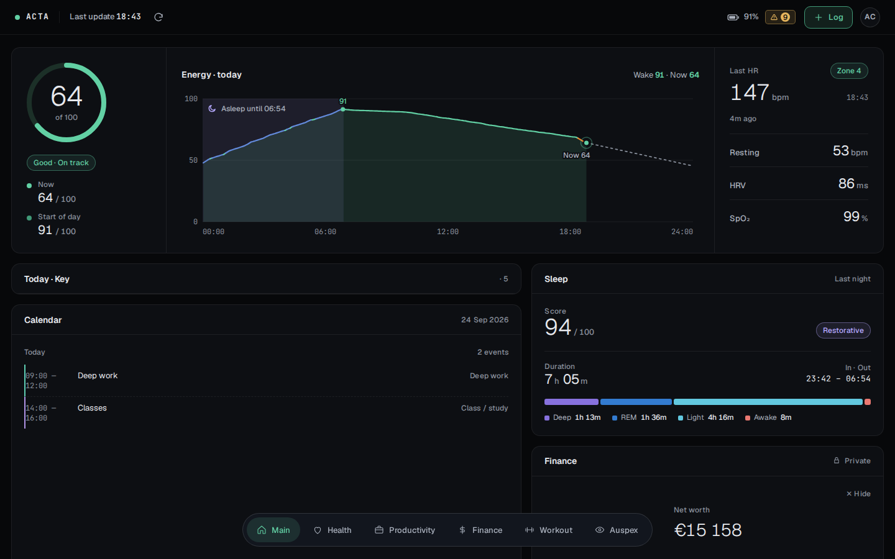
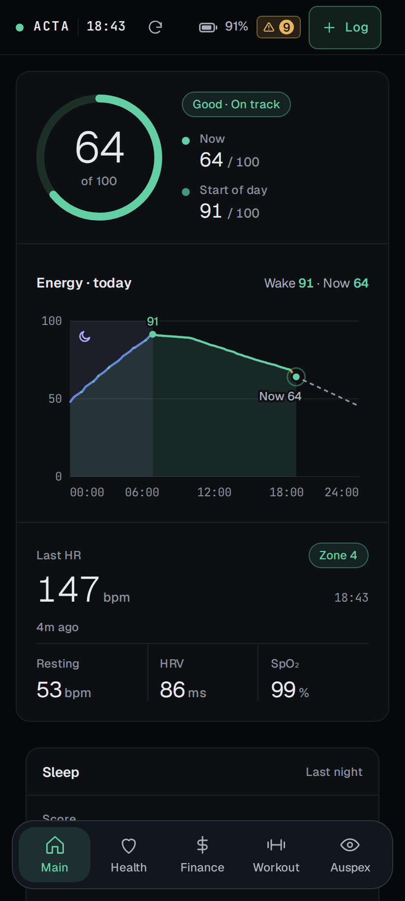
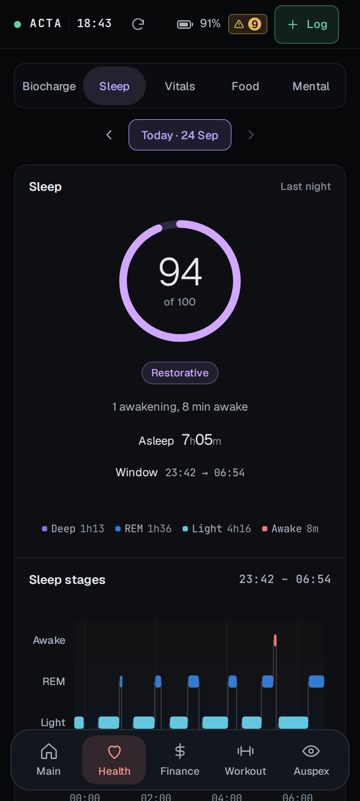
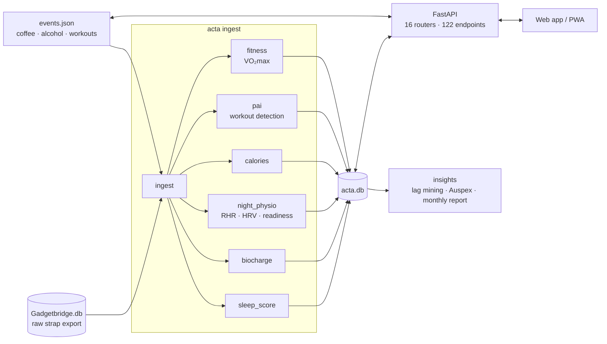

# Acta

[](https://github.com/simaovc32/acta/actions/workflows/ci.yml)

A self-hosted personal health dashboard. It turns the raw data of a cheap fitness strap
into a minute-by-minute energy model, nightly sleep scores, recovery and training-load
signals, and puts food, workouts, money and planning in the same app.

I built it for myself and have used it every day since May 2026 with an Amazfit (Huami/Zepp)
strap, read through [Gadgetbridge](https://gadgetbridge.org/). This repository is a
cleaned-up, runnable edition: it ships with a synthetic person so anyone can try it without
a strap.



<p align="center">
  
  
</p>

## What it does

| | |
|---|---|
| **BioCharge** | A 0–100 energy level for every minute of the day. It recharges during sleep (weighted by sleep stage, capped by the night's score) and drains while awake by heart-rate zone, stress and logged events such as coffee or alcohol. |
| **Sleep score** | Nightly 0–100 from efficiency, regularity, duration, stage balance and overnight physiology, each compared with your own rolling baseline. Every score comes with a plain-language "why". |
| **Recovery** | Readiness (sleep, resting HR, HRV, training load) and a recovery alarm that tells a slow multi-night decline from an acute one-night hit. |
| **Training** | Detects workouts you never logged from the strap's PAI data and proposes them for confirmation. Also estimates VO₂max (two published models, reported as a range), heart-rate recovery and calories burned. |
| **Workout tab** | A weekly plan, guided sessions with rest timers, a soreness body map, and a review of each run against its target heart-rate zones. |
| **Food** | A food library with meals and portion sizes. An optional LLM looks up unknown foods. Caffeine and alcohol flow into the energy model and the sleep score. |
| **Finance** | Net worth from balance snapshots, spending ledger, subscriptions, investments priced from public feeds, a wish list. Behind a PIN. |
| **Insights** | Lag mining (every predictor × target × lag, with Benjamini–Hochberg FDR), a monthly report, and *Auspex*: preset questions where Python computes the verdict and a language model only narrates it. |
| **Productivity** | Kanban boards and a recurring weekly schedule. |

More screenshots: [biocharge](docs/screenshots/biocharge.png) ·
[sleep](docs/screenshots/sleep.png) · [vitals](docs/screenshots/vitals.png) ·
[food](docs/screenshots/food.png) · [workout](docs/screenshots/workout.png) ·
[body map](docs/screenshots/bodymap.png) · [finance](docs/screenshots/finance.png) ·
[productivity](docs/screenshots/productivity.png) · [auspex](docs/screenshots/auspex.png)

## Try it

Requires Python 3.11+. Clone the repository, then:

```bash
python -m venv .venv && source .venv/bin/activate
pip install -e ".[dev]"
acta demo     # builds a synthetic person in ./data (about 5 seconds)
acta serve    # open http://127.0.0.1:8000, finance PIN 4321
```

`acta demo` doesn't load a canned database. It writes a fake Gadgetbridge export: ten weeks
of minute-level heart rate, steps, stress, SpO₂, HRV and sleep-stage recordings, all in the
strap's real formats. Then it runs the real ingest pipeline over that export and fills in
the manual side (food, workouts, finance, to-dos) through the real API. The invented person
has patterns for the algorithms to find: a slow training effect, beer on some weekend
nights, and a football game every other Sunday that is never logged.

## With a real strap

Acta reads the database that the Gadgetbridge Android app keeps. You pair the strap with
Gadgetbridge, turn on its automatic database export, sync that file to the machine running
Acta, and run `acta ingest` on a timer:

```bash
export ACTA_GADGETBRIDGE_DB=~/sync/Gadgetbridge.db
acta ingest
```

The step-by-step guide (pairing and the auth key, which measurements to enable, export and
sync) is in [docs/gadgetbridge.md](docs/gadgetbridge.md). Only Huami/Zepp (Amazfit)
devices are supported. Every setting is an environment variable (see
[`src/acta/config.py`](src/acta/config.py)), and example systemd units are in
[`deploy/`](deploy/).

## How it's built



- **Backend:** Python and FastAPI over SQLite. The algorithms use only the standard
  library, with no numpy, pandas or scikit-learn.
- **Frontend:** plain HTML, CSS and JavaScript with hand-drawn SVG charts; no framework and
  no build step. It installs as a PWA on a phone.
- **Pipeline:** idempotent and incremental. A cheap file fingerprint gates a content hash,
  which gates the recompute. Only new nights are scored, and biocharge is replayed forward
  from the last settled day.

More detail: [docs/architecture.md](docs/architecture.md) (data flow, storage, design rules)
and [docs/algorithms.md](docs/algorithms.md) (how each number is computed).

```
src/acta/
  config.py        every path and setting, from environment variables
  pipeline/        ingest: Gadgetbridge export -> acta.db
  engine/          biocharge, sleep score, night physiology, PAI, VO2max, calories
  tracking/        body, food, activities
  insights/        lag mining, Auspex, experiments, monthly report, small ML models
  finance/         ledger, holdings and price feed, spending, capture API
  productivity/    Kanban boards, Obsidian reader
  api/             FastAPI app, one router per area
  demo/            the synthetic person
web/               dashboard (index.html, css/, js/)
tests/             pytest suite
```

## Design rules

These run through the code:

- **Measure the body, don't echo the user.** Self-reports (mood, "how did I sleep") are
  shown and described, but never fitted to and never fed into a score. A model tuned to
  how you say you feel can only hand back your own opinion.
- **History doesn't move silently.** Every change to a scoring model is *forward-only*,
  gated by the date it shipped. Settled days keep the numbers they were computed with.
- **Propose, then confirm.** Detected workouts, balances implied by transactions and
  AI-captured purchases wait for a human yes. Nothing rewrites the user's data on a guess.
- **Explain every number.** Scores come with the reason they went up or down.

## Calibrated on one person

Acta was built around one body: mine. I need about 7 hours of sleep, have a low resting
heart rate, and train most days. The design copes with that in two ways, and it's worth
knowing which is which:

- **Most scores are relative to you.** Sleep duration, stage balance, resting HR, HRV,
  training load and readiness are all judged against *your own* rolling baseline, not
  against a guideline. If you normally sleep 8 h, 8 h scores as normal for you; for me it
  is 7 h. The flip side is that Acta won't tell a chronic short sleeper to sleep more,
  because it measures change against you, not health against a norm.
- **Some constants were tuned on my data** and may not fit yours: the biocharge
  heart-rate zones and the maximum HR it tops out at, the nap recharge rate, and the
  starting reference for training load (it switches to your own sessions after three).
  During the first week, before any baseline exists, the sleep score falls back to general
  adult defaults (around 7.5 h).

Treat the numbers as a way to compare you with yourself over time. The details are in
[docs/algorithms.md](docs/algorithms.md#calibration).

## Tests

```bash
pytest          # 46 tests, about 440 named checks
ruff check src tests
```

The suite covers the scoring engines, food, finance (including a stubbed price feed), the
capture API's security rules, and an end-to-end test. That test generates a synthetic strap
export, runs the pipeline, and checks that it finds what the generator planted: the unlogged
football games, and the raised resting HR and lower HRV after drinking.

This edition was restructured from the single-user codebase I run at home (a 5,700-line
`api.py` became 16 routers, and the scripts became one package). Before publishing, I ran
the original and the restructured code side by side on the same synthetic data. The ingest
output matched table for table and all tested GET endpoints returned identical JSON.

## How it was built

The code in this repository was written by [Claude Code](https://claude.com/claude-code),
Anthropic's AI coding agent. The ideas, decisions and testing were mine:

- **What to build and why.** Every feature and design rule started as a problem I had
  using it every day.
- **Debating the approach.** Most algorithms went through several rounds of discussion
  before any code was written: what the sleep score should measure, and why self-reports
  must never feed a score.
- **Testing it on real data.** I've run it on my own strap every day since May 2026.
  When a number didn't match how a night or a workout actually went, I pushed back until
  we found the cause. Several of the fixes in [docs/algorithms.md](docs/algorithms.md)
  came from that.
- **Design.** I sketched layouts and asked for changes until they felt right.

I'm sharing it as an example of building with an AI agent over months rather than in a
single prompt: a tool I rely on every day.

## Limitations

- Single-user by design: no accounts, meant to run on your own machine or private network.
- Only Huami/Zepp straps through Gadgetbridge.
- The interface is in English. Its text goes through a small translation table that also
  has Portuguese, but there's no switch for it in the UI. Some food examples in the
  food-lookup prompt are Portuguese on purpose, so Portuguese descriptions work.
- `web/js/app/live.js` is one 3,300+-line closure that renders the health screens.
- The food lookup and Auspex narration need an [OpenRouter](https://openrouter.ai/) key
  (`OPENROUTER_API_KEY`); without one those features say so and the rest works.

## License

[MIT](LICENSE) © 2026 Simão Vicente Costa
